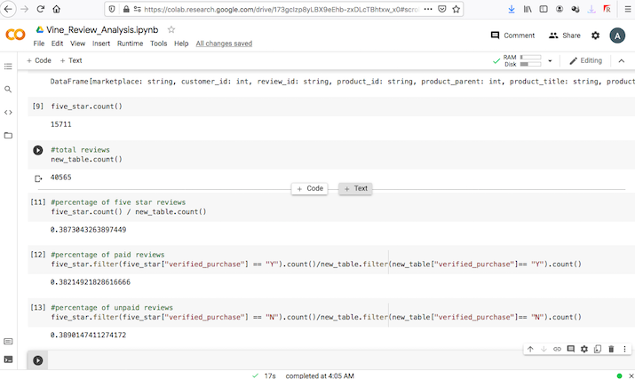

# Amazon_Vine_Analysis

## Overview of the analysis:

After selecting my dataset Pyspark was utilized to perform the ETL process by extracting the data, transforming the data and (loading) connecting to the postgres database that was generated through AWS. I wanted to determine if there was any bias in reviews from Amazon Vine members.

## Results:

- How many Vine reviews and non-Vine reviews were there? 4,291 vine reviews, and 40,471 non-vine reviews
- How many Vine reviews were 5 stars? How many non-Vine reviews were 5 stars? 15,711 5-star reviews, and 5,663 non-vine 5-star reviews
- What percentage of Vine reviews were 5 stars? What percentage of non-Vine reviews were 5 stars? 38.2% of the five_star reviews were vine, and 38.9% of the five_star reviews were non-vine

## Summary:

It would appear as if there is in fact no noticeable bias due to the fact that the percentage of five-star reviews from vine and non-vine customers are very close. In conclusion we can confidently say that there is no significant bias.
